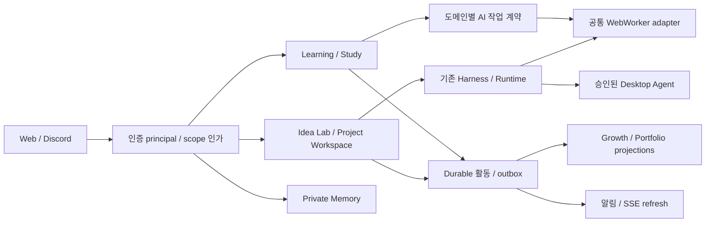

# NPC 단계적 확장 아키텍처

상태: 승인된 방향 1을 기준으로 계속 갱신하는 설계·구현 경계 문서다. 사용자별 AI 프로필, 개인 기억, 학습, 활동·성장, 포트폴리오와 공개 projection의 일부가 기존 JSON durable store 위에 구현되어 있으며, 현재 구현·검증 수준은 [기능 인벤토리](ISEOL_FEATURE_INVENTORY.md)를 따른다. DB 전환이나 기존 데이터 소유권 자동 부여는 이번 범위가 아니다.

## 경계와 원칙

현재 제품 브랜드는 NPC(Nexus Personal Console)이며, 이설은 NPC 안에서 사용자별로 동작하는 개인 AI 에이전트의 통칭이다. 사용자별 AI 프로필은 `src/ai-agent`에 저장하고, 기존 사용자·세션·개인 기억·AI Chat의 소유권 경계를 재사용한다. 프로필 이름과 표현은 사용자 설정이지만, 실행 권한과 외부 부작용 권한을 부여하지 않는다.

기존 Runtime/Harness는 개발 실행 권위, learning store는 학습 권위, growth ledger는 활동 평가 결과 권위다. SSE/Discord/캐릭터는 projection이다. 사용자 AI 대화나 외부 브라우저가 권위 있는 저장소가 되지 않는다.

### 사용자와 저장 경로

제안 `Principal={userId,sessionId,roles}`는 서버가 인증 결과로 만든다. body의 userId를 믿지 않는다. `Scope={kind:'personal',ownerUserId}|{kind:'team',teamId}`와 resource ACL을 모든 read/write/event/AI context에 적용한다. legacy 자원은 `legacy-operator` 관리 영역으로 남기며 신규 사용자가 자동 소유하지 않는다. 명시적 매핑/마이그레이션은 향후 별도 승인 작업이다.

새 데이터만 별도 `platformRoot/users/<id>/`, `platformRoot/teams/<id>/`에 저장한다. ID path traversal과 symlink를 검증하고 파일 직접 접근 권한도 제한한다. 저장 경로 분리는 서버 인가의 대체물이 아니다. shared JSON에는 공용 Runtime writer를 하나만 둔다. 원자적 rename만으로 다중 프로세스 transaction/CAS를 보장하지 않는다. 새 store는 lock 안에서 revision 확인→write→release; stale lock 자동 takeover 금지. 대규모/다중 서버 배포는 transactional DB 도입 별도 설계가 필요하다.

여러 파일에 걸친 기록은 durable operation record와 idempotent 단계 재처리로 복구한다. outbox fact 생성 전 crash 누락을 막기 위해 source aggregate에 pending event identity를 함께 기록하고, dispatcher가 이를 안정 ID의 fact로 materialize한다. 알림 전송 UNKNOWN은 조회/운영 확인 전 재발신하지 않는다.

## 도메인별 계약

| 도메인 | 책임/핵심 데이터 | 소유·공유 | 재사용 / 새 구현 | 제안 연결 / 권한 | 핵심 테스트 |
|---|---|---|---|---|---|
| A 사용자/인증 | User, Session, Membership, Grant | private account, team role | 기존 operator DPAPI는 운영용 유지; 새 `src/identity` | `/api/me`, resource authorize; Web bearer를 일반 로그인으로 취급 금지 | 타 사용자 IDOR, revoke, session 만료, CSRF |
| B 세계/캐릭터 | World, Character, cosmetic preferences | owner private, 공개 subset | 새 `src/personal-world` | `/api/me/world`; 활동 projection 읽기 | 남의 캐릭터 편집/비공개 노출 거부 |
| C 개인 AI/기억 | MemoryItem, SourceRef, consent, confidence | owner 기본; team memory 별도 | prompt/session safety 재사용, 새 `src/memory` | context assembler가 scope 필터 후 검색 | A→B 기억 누출, 삭제후 캐시, prompt injection |
| D 활동/성장 | ActivityFact, Contribution, GrowthAward/Reversal | owner 및 승인된 team evidence | history/evidence 참조, 새 `src/activity`,`src/growth` | `assessment.verified`, `contribution.recorded`; unique source+rule | 재전달 가산 1회, AI/사람 귀속, 정정 |
| E Idea Lab | campaign/proposal/production/candidate | legacy 보존, 신규 scope | `src/idea-lab`, prototype store | 기존 API 보존, 후속 scope 추가 | 여러 후보 실패 격리, UNKNOWN barrier |
| F 프로젝트 | workspace/tree/Run/queue/history | 개인/팀 프로젝트 ACL | `src/project-model`, portfolio | 기존 API에 actor/scope 경계 추가 | Run identity, 승격 root, queue crash |
| G 실행 | owner/lease/approval/intent/result | project grant와 agent workspace | Runtime/Harness/Desktop 그대로 | permission snapshot을 실행 직전 재확인 | contained 차단, revoke, stop/recovery 경쟁 |
| H 학습 | Goal/PlanVersion/Session/Answer/Feedback/Review | 사용자 private | 구현된 `src/learning`; AI transport는 명시적 local adapter로만 재사용 | canonical `/api/user/learning/*` (설계 축약 `/api/learning/*`) 및 평가 evidence | 중복 답변, UNKNOWN, 계획 CAS |
| I 스터디 | StudySpace, CurriculumLink, shared task | membership 공유, 개인 진도 비공개 | 음성 시간은 activity 입력일 뿐; 새 `src/study` | `/api/studies/*`, opt-in sharing | 탈퇴 이후 접근, 개인 오답 비공개 |
| J 혼합 팀 | HumanMember/AIMember, Role, grant | team scoped | Discord binding 참고, 새 `src/teams` | 사람 승인 membership; AI execution delegation | AI가 승인/권한상승 불가 |
| K 교류 | friend request, message, community post, moderation | 관계/채널별 ACL | 새 `src/social` | `/api/friends`, `/api/conversations`, `/api/communities` | 차단/신고, 삭제/보존, 타 채널 노출 |
| L 모집 | posting/application/decision | 공개 공고, 비공개 지원서 | 새 `src/recruitment` | accept가 하나의 membership op 생성 | 중복 승인, 취소/만료, 권한 없는 승인 |
| M 포트폴리오 | evidence claim/draft/revision/publication | private draft, 공개 snapshot | `portfolio.ts`, `portfolio-store.ts` | `/portfolio`; evidence 공개 권한 별도 | AI 기여 명시, 깨진 reference, 비공개 링크 |
| N 외부 연동 | binding/delivery/provider evidence | user/team opt-in | 기존 Discord/Calendar/GitHub/review/deploy | 외부 발신/계정 변경은 기존 승인 | timeout UNKNOWN, 중복 provider callback, 서명 |

## AI 실행 재사용의 실제 한계

`src/chatgpt-web`의 session/turn/intent, extraction, credential-safety와 bounded correction을 활용할 수 있다. 그러나 현재 prompt/compiler와 executor는 Harness stage 및 개발 작업 schema에 결합되어 있다. 학습을 IMPLEMENT/ANALYZE Run으로 위장하지 않는다.

제안 `AiWorkRequest={id,scope,domain,templateId,templateVersion,inputRef,inputHash,budget,authorizationRef}`와 `AiWorkResult={requestId,status,validatedOutputRef,diagnosticCode}`를 새 adapter에서 제공한다. 기존 개발 adapter는 그대로 유지하고 학습 전용 output validator/dispatcher를 추가한다. provider가 없는 환경에는 configured=false를 보여 주며 mock 답변을 실제 AI 결과로 표시하지 않는다. 유료 API는 필수 의존성이 아니고 각 provider의 계정/사용량 제한을 지킨다.

장기 기억은 원문 대화 전체 주입이 아니라 출처 있는 bounded 요약이다. context item마다 owner/scope/sourceRevision/verifiedAt/consent를 둔다. 다른 사용자의 동일한 입력이라도 개인화 응답 캐시를 공유하지 않는다. 팀 AI에는 team-approved context만 전달한다.

## 자원과 실행 권한

학습 계획은 브라우저를 일수만큼 유지하지 않는다. 요청 시 claim하고 제한된 세션에서 결과를 검증·저장한 후 release한다. 기본 신규 learning worker 동시 실행은 배포 단위 1, 사용자별 1로 시작하고 실제 provider 한도에 따라 조정한다. tenant별 큐 길이/일일 예산/출력 크기/timeout/correction 상한을 설정한다. rate limit/UNKNOWN은 대기로 보존하며 계정·세션 증설로 우회하지 않는다.

학습 콘텐츠의 코드 실행은 임의 shell이 아니다. 새 exercise policy에 따라 격리 fixture 또는 승인된 Desktop intent만 허용한다. 문제 풀기 버튼이 Git push/배포/Discord 발신을 승인하지 않는다. 개발과 학습 간 연결은 먼저 제안/초안이며 실행 승인 계약을 유지한다.

## 현재 결함과 마이그레이션 순서

1. 모델 root 한 단계 중복, project 목록 누락, promotion source/destination root 혼용을 격리 재현한다.
2. Runtime root를 바꾸기 전에 startup recovery가 기존 UNKNOWN을 발견해도 실행하지 않는지 검증한다.
3. Project terminal 결과→queue 반영, scheduler 전체 동시성, transient claim 상태와 명시 재개 UX를 보완한다.
4. 사용자 인가를 새 private 도메인부터 도입하고 legacy 운영 공간은 그대로 둔다.
5. 새 학습/활동/기억의 durable 계약 검증 후 공개 multi-user로 확대한다.

새 서버 인증 provider/DB/vendor는 이 문서로 확정하지 않는다. 기존 스택 위에 authentication interface를 설계하고 구현 세션에서 지원 환경과 credential 관리 계약을 검증한다. 미구현 권한으로 기존 운영 데이터를 공개하지 않는다.
